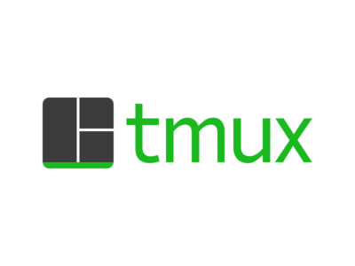

# SkilStak `tmux` Screen-Compatible Configuration

*[This repo is mirrored from  GitLab (a far superior Git hosting platform).](https://gitlab.com/skilstak/config/tmux)*

Part of the [SkilStak Terminal Master configuration](https://gitlab.com/skilstak/config).

The `tmux` terminal multiplexer is a standard tool these days but keeping its usage compatible with the original `screen` has obvious objective benefits in terms of muscle memory. `screen` is on everything by default. `tmux` isn't.

This configuration also assumes you are a `vim` user/master.
